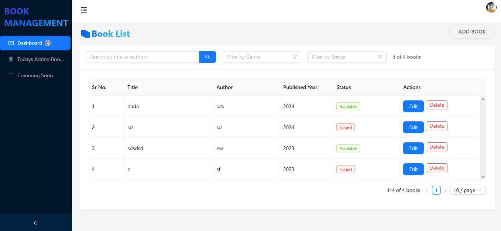
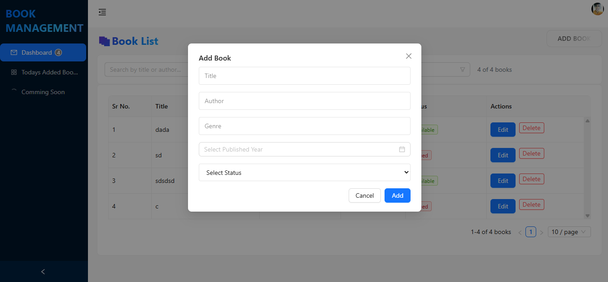
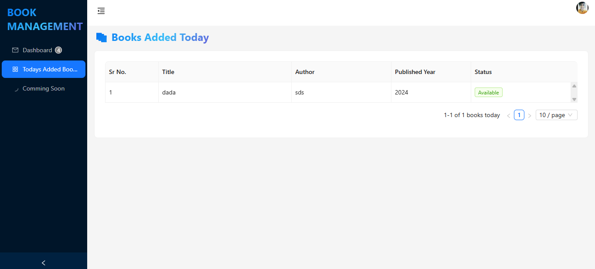
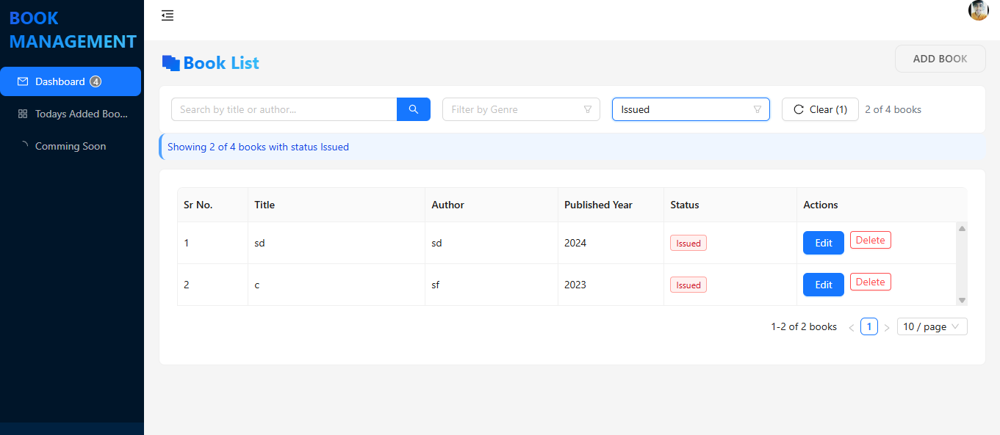
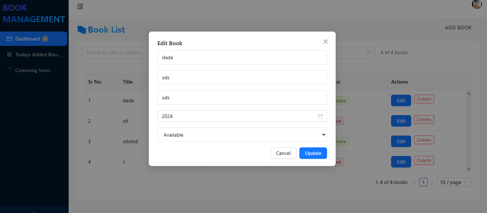

# 📚 Book Management System

A responsive and feature-rich **Book Management System** built with **React + Vite + TypeScript**, integrated with **Clerk Auth**, **Ant Design**, **React Query**, **TailwindCSS**, and more.

---

## 🚀 Features

- 🔐 **User Authentication** (via Clerk)
- 📖 **Add / Edit / Delete / View** books
- 🔎 **Search by Title or Author**
- 🎯 **Filter by Genre and Status**
- 🏷️ **Status Indicators** (Available / Issued)
- 📆 **Published Year Picker**
- 📱 **Responsive Design**
- ⚡ **React Query** for fast & cached API handling
- 🧠 **Global State via Context**
- 🧪 **Protected Routes**
- 🛠️ **Vite + TypeScript + TailwindCSS**

---


## 🧰 Tech Stack

| Tech               | Description                              |
|--------------------|------------------------------------------|
| **React + Vite**   | Frontend framework                       |
| **TypeScript**     | Type safety                              |
| **Clerk**          | Authentication and user management       |
| **Ant Design**     | UI Components                            |
| **Tailwind CSS**   | Utility-first CSS styling                |
| **React Query**    | Server state and API caching             |
| **React Hook Form**| Form validation                          |
| **Toastify**       | Notifications                            |
| **Context**        |  State management

---

## 📸 Screenshots

| 📋 Dashboard | ➕ Add Book | 📆 Today’s Books |
|--------------|------------|------------------|
|  |  |  |

| 🧰 Filters |
|------------|
|  |

| 🧰 edit |
|------------|
|  |


---

## 📦 Installation

```bash
# 1. Clone the repo
git clone https://github.com/Ankitb3/book-management-app.git
cd book-management-app

# 2. Install dependencies
npm install

#3- Make sure add .env file //i  provide this api keys send personaly
VITE_CLERK_PUBLISHABLE_KEY=pk_test_XXXXXXXXXXXXXXXXXXXXXXXXX
VITE_LOCALHOST_URL=https://682f1a54746XXXXXXXXXXXX


# 4. Start the dev server
npm run dev
